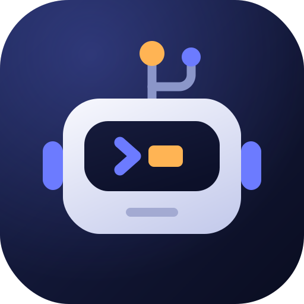

<div align="center">



# DevBot

**Everything for agentic software development.**

[](LICENSE)
[](https://get-e.github.io/dev-bot/)
[](https://opencode.ai/)
[](https://www.anthropic.com/claude-code)

</div>

DevBot is a **meta-harness** for the GET-E engineering team. It installs a complete
agentic development workflow — a pair programming agent, persistent memory shared
across colleagues and codebases, curated skills, and managed MCP servers — into
[OpenCode](https://opencode.ai/) or [Claude Code](https://www.anthropic.com/claude-code).

It serves a **dual purpose**:

1. **Pair Programming Agent (daily driver):** works alongside you in small
   increments — exploring, designing, and writing together. It primes context at
   session start, recalls past decisions, and loads the right skills for the job.
   It is never autonomous; you stay in control.
2. **Multi-Agent Orchestrator (power user):** classifies work and routes it to
   specialized subagents — Architect, Developer, Tester, Reviewer, Critic, PO,
   Scout, Security — in structured plan → implement → review cycles with verified
   deliverables at every gate.

This README is a brief overview. For comprehensive details, see the
[full documentation](https://get-e.github.io/dev-bot/).

---

## Why DevBot?

- You work in several projects, each should have their own memory and also a shared global memory
- You work in a team and you want to share and build your projects knowledge bases (memories) together
- You work in a team where members are using different harnesses but you want everyone's agents working in the same way, with similar outputs and outcomes
- You want your agents to have all skills they need to develop projects following industry best practices
- You want a set of curated MCPs for your agents to use
- You work with several harness instances open but don't want to duplicate MCP servers with each instance

---

## Quick Start

### Install

The repository is private, so the installer is served from the docs site:

```shell
curl -fsSL https://get-e.github.io/dev-bot/install.sh | bash -s -- --ssh
```

> [!NOTE]
> `--ssh` clones over SSH (`git@github.com:GET-E/dev-bot.git`). Drop it to clone
> over HTTPS, or pass `--org <org> --repo <repo> --branch <branch> --host <host>`
> to install from a fork. From an existing clone, `make install` runs the same
> installer.

Configuration is read from `.devbot.global.dist.jsonc`, copied to
`.devbot.global.jsonc` on install. Edit it to change `modules`, `guards`, or
`external_modules` before installing.

### Initialize a project

```shell
cd path/to/your-project
devbot init
```

This wires the agents, commands, skills, tools, and MCP servers into the project.
To override the global configuration for one project, edit
`.devbot.project.jsonc` and run `devbot reinit`.

### Start working

```shell
devbot
```

Brings up the local services and starts the configured harness. Use `devbot up`
to start only the services, and `devbot help` to list every command.

### Prime the project context

Run this once per project, from inside the agent session. It writes
`.agents/memory/active/project.md` — the bootstrap description every agent reads
at session start:

```shell
/create-project-report
```

### Manage services and updates

```shell
devbot down     # stop the local services
devbot update   # update to the latest release tag
```

---

## Documentation

Every docs page lives in [`docs/`](docs/). Start at the
[documentation site](https://get-e.github.io/dev-bot/).

1. [CLI commands](docs/cli-commands.md)
2. [Agents](docs/agents.md)
3. [Slash commands](docs/commands.md)
4. [Skills](docs/skills.md)
5. [Hooks](docs/hooks.md)
6. [MCPs](docs/mcps.md)
7. [MCP configuration](docs/mcp-config.md)
8. [Harnesses](docs/harnesses.md)
9. [Tools](docs/tools/index.md)
   1. [Agent communication](docs/tools/agent-communication.md)
   2. [Auto-recover](docs/tools/auto-recover.md)
   3. [Codebase index](docs/tools/codebase-index.md)
   4. [Codebase memory](docs/tools/codebase-memory.md)
   5. [Format JSON](docs/tools/format-json.md)
   6. [Format Markdown](docs/tools/format-md.md)
   7. [Format YAML](docs/tools/format-yml.md)
   8. [Git report](docs/tools/git-report.md)
   9. [Graphify](docs/tools/graphify.md)
   10. [Guards](docs/tools/guards.md)
   11. [Kubernetes](docs/tools/k8s.md)
   12. [LiteLLM](docs/tools/litellm.md)
   13. [mdctx](docs/tools/mdctx.md)
   14. [Ollama](docs/tools/ollama.md)
   15. [QMD](docs/tools/qmd.md)
   16. [Remember session](docs/tools/remember-session.md)
   17. [Repomix](docs/tools/repomix.md)
   18. [Signoz](docs/tools/signoz.md)
   19. [Tree](docs/tools/tree.md)
10. [Configuration](docs/configuration.md)
11. [Module reference](docs/module-reference.md)
12. [Create a module](docs/create-a-module.md)
13. [Modules & tools map](docs/modules-and-tools.html)

> The per-harness pages under `docs/opencode/` and `docs/claudecode/` are
> excluded from the docs site build and are not listed here.

---

## License

Released under the [MIT License](LICENSE).
